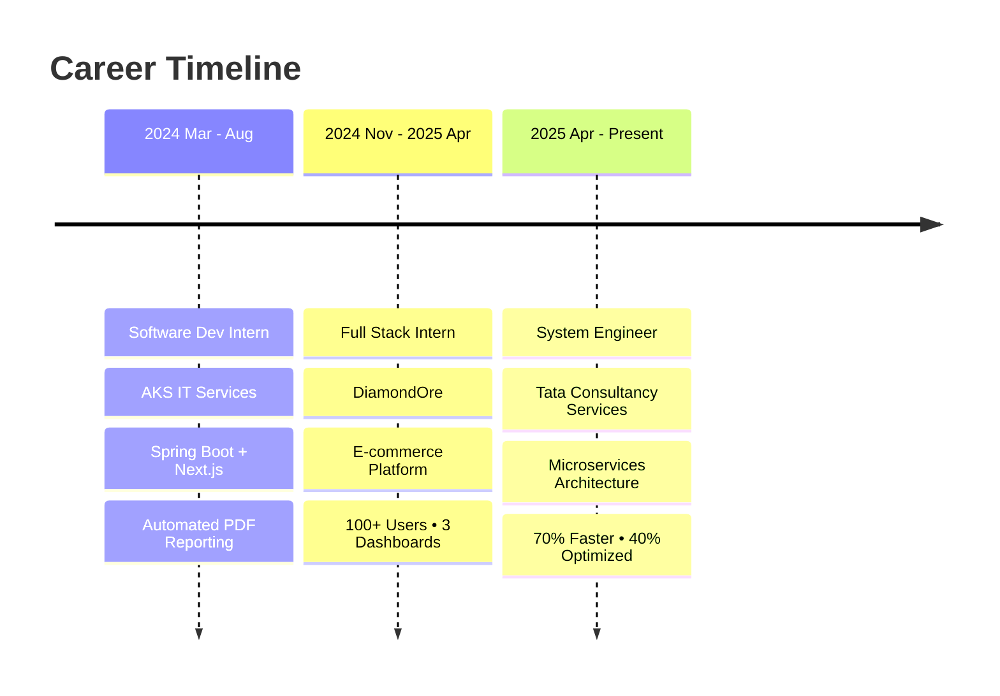

<p align="center">
  <a href="https://git.io/typing-svg"></a>
</p>

<p align="center">
  <a href="https://piyush-gupta-profile.vercel.app/" target="_blank"></a>&nbsp;
  <a href="https://linkedin.com/in/piyush-gupta-06b020213" target="_blank"></a>&nbsp;
  <a href="https://leetcode.com/u/CodWin123/" target="_blank"></a>&nbsp;
  <a href="https://www.npmjs.com/package/create-setup-express-backend" target="_blank"></a>&nbsp;
  <a href="mailto:piyushguptaji123@gmail.com"></a>
</p>

<p align="center">
  
  
</p>

---

##  About Me

```typescript
const piyush: Developer = {
    role: "System Engineer @ Tata Consultancy Services",
    location: "Noida, India",
    education: "B.Tech CSE — KIET Group of Institutions (8.04 CGPA)",
    currentWork: {
        company: "TCS",
        stack: ["Spring Boot", "Microservices", "Redis", "React"],
        impact: "70% faster response times • 40% query optimization"
    },
    superpower: "Building scalable backend systems that handle real production load",
    leetcode: { solved: "767+", rating: 1804, badge: "Knight ⚔️", rank: "Top 7.59%" },
    funFact: "I automated my own workflow by publishing an npm package 📦"
};
```

---

##  Tech Stack

<table align="center">
<tr><td align="center" width="25%">

**💻 Languages**
<br>


</td><td align="center" width="25%">

**⚙️ Backend**
<br>


</td></tr>
<tr><td align="center" width="25%">

**🎨 Frontend**
<br>


</td><td align="center" width="25%">

**🗄️ Database & Tools**
<br>


</td></tr>
</table>

<p align="center">
  
  
  
  
  
  
  
</p>

---

##  Featured Projects

<table>
<tr><td width="50%">

**🏗️ [TaskFlow](https://github.com/hackhub817/taskflow-piyush-gupta)**
<br>Enterprise-grade task management application
<br><br>


<br>
✅ Role-based access control (RBAC)<br>
✅ Real-time task updates<br>
✅ Enterprise security patterns
</td><td width="50%">

**🎮 [ClickRace Arena](https://github.com/hackhub817/project-deploy)** &nbsp; [](https://deploy-real-time-app.onrender.com/)
<br>Real-time competitive multiplayer game
<br><br>


<br>
⚡ Zero-latency live leaderboard<br>
⚡ Dual dashboards (Analytics + Admin)<br>
⚡ Concurrent multiplayer support
</td></tr>
<tr><td width="50%">

**🌐 [BobnBuilder](https://github.com/hackhub817/full-stack-project)** &nbsp; [](https://love-bird.onrender.com/)
<br>Dynamic website generation engine
<br><br>


<br>
🚀 50+ early users onboarded<br>
🚀 Auto-deploy customized landing pages<br>
🚀 Template validation engine
</td><td width="50%">

**🎓 [College Aur Corporate](https://collegeaurcorporate.com/)** &nbsp; [](https://collegeaurcorporate.com/)
<br>Mentorship platform for Tier-3 students
<br><br>


<br>
🎯 Coding guidance & career mentorship<br>
🎯 Smart MVP — Google Sheets as backend<br>
🎯 Built for students, by engineers
</td></tr>
<tr><td width="50%">

**🧩 [Chrome Analyser](https://github.com/hackhub817/chrome-extension-analyser)**
<br>AI-powered Chrome extension
<br><br>


<br>
🤖 AI-powered website analysis<br>
🤖 Auto-generated reports<br>
🤖 Screenshot capture + sharing
</td><td width="50%">

**☕ [QuizApp](https://github.com/hackhub817/QuizApp)**
<br>Spring Boot REST API for quiz management
<br><br>


<br>
📝 Full CRUD quiz management<br>
📝 RESTful API architecture<br>
📝 Clean service-layer pattern
</td></tr>
</table>

---

## 💼 Professional Journey



---

## 🏆 Achievements & Awards

<p align="center">
  
</p>

<table align="center">
<tr>
<td align="center">⚔️<br><b>LeetCode Knight</b><br>Rating 1804<br>767+ Problems<br>Top 7.59%</td>
<td align="center">🥇<br><b>EdXR Gold</b><br>Hackathon Winner<br>€400 Prize<br>International</td>
<td align="center">🏅<br><b>SIH 2022</b><br>National Finalist<br>Team of 6<br>KLE Karnataka</td>
<td align="center">🏆<br><b>Innovation 1st</b><br>College Winner<br>Seed Funding<br>Prototype</td>
<td align="center">📦<br><b>npm Author</b><br>Published Package<br>Express CLI<br>Open Source</td>
</tr>
</table>

---

## 📈 LeetCode Stats

<p align="center">
  
</p>

---

## 📊 GitHub Analytics

<p align="center">
  
  
</p>

<p align="center">
  
</p>

<p align="center">
  
</p>

---

## 🐍 Contribution Snake

<p align="center">
  <picture>
    <source media="(prefers-color-scheme: dark)" srcset="https://raw.githubusercontent.com/hackhub817/hackhub817/output/github-snake-dark.svg" />
    <source media="(prefers-color-scheme: light)" srcset="https://raw.githubusercontent.com/hackhub817/hackhub817/output/github-snake.svg" />
    
  </picture>
</p>

---

<details>
<summary>📬 <b>Connect With Me</b></summary>
<br>
<p align="center">
  <a href="https://piyush-gupta-profile.vercel.app/"></a>
  <a href="https://linkedin.com/in/piyush-gupta-06b020213"></a>
  <a href="https://leetcode.com/u/CodWin123/"></a>
  <a href="mailto:piyushguptaji123@gmail.com"></a>
  <a href="https://www.npmjs.com/package/create-setup-express-backend"></a>
</p>
</details>

---

<p align="center">
  
</p>


